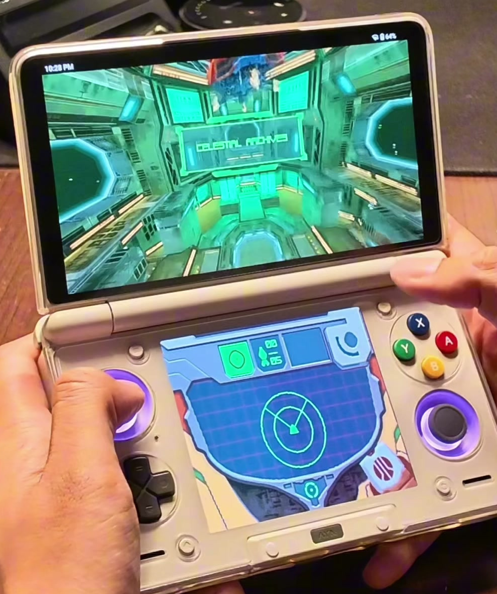

<p align="center">
  
</p>

<h1 align="center">Hunters Recomp</h1>

<p align="center">
  <b>Metroid Prime Hunters, running natively on the AYN Thor.</b><br/>
  The first Android port of the Metroid Prime Hunters recompilation:
  true dual-screen, twin-stick Prime controls, and HD rendering on real handheld hardware.
</p>

---

## See it running

<p align="center">
  <a href="https://youtube.com/shorts/t5mwzJvtyqY">
    
  </a>
  <br/>
  <sub><b><a href="https://youtube.com/shorts/t5mwzJvtyqY">▶ Watch: dual-screen gameplay on the Thor</a></b></sub>
</p>

## What is this?

A native Android port of
[mstan/MetroidPrimeHuntersRecomp](https://github.com/mstan/MetroidPrimeHuntersRecomp)
(built on the [ndsrecomp](https://github.com/mstan/ndsrecomp) static
recompilation framework), wrapped as an APK and adapted for the AYN Thor's
dual-screen handheld hardware. This is not an emulator frontend: the game's
ARM9/ARM7 code is statically recompiled to native arm64 and runs directly on
the Snapdragon.

**No game data is included.** You must supply your own dump of your own
cartridge (see below). The app hash-verifies it and refuses anything else.

## Features

- **True dual-screen**: top screen fills the Thor's main display, bottom
  screen lives on the Thor's second panel with working touch (stylus) input,
  in Original 4:3 or Stretch
- **Twin-stick Prime controls**: left stick moves, right stick aims
  (melonPrimeDS-style bindings), triggers shoot; every action rebindable
- **HD rendering**: the desktop GL 4.3 compute renderer ported to GLES 3.2,
  up to 4x internal resolution and xBR texture upscaling (3x recommended)
- **Performance**: the game's hot code is compiled to native banks (no
  interpreter fallback in play); measured 58-59 fps with the interpreter
  eliminated, see [docs/AUDIT-2026-09-05.md](docs/AUDIT-2026-09-05.md)
- **RetroAchievements**: built-in rcheevos client with login, hardcore mode,
  unlock pop-ups, an achievements browser in settings, and an optional RA
  strip on the bottom screen (see the hash note below)
- **Second-screen companion**: while the launcher is open, the bottom panel
  shows a live controller map of your bindings and your RA progress
- **Diagnostics**: engine-true FPS counter, one-tap "Share Diagnostics" zip
  for bug reports, every session also records coverage that feeds the next
  performance round
- **Fast-forward**: hold SELECT to blitz through cinematics; START skips FMVs

### RetroAchievements hash note

This port runs the USA rev 0 cartridge. retroachievements.org currently
links only the rev 1 hash to Metroid Prime Hunters (game 1378), so rev 0 is
reported as unknown. The app has an opt-in switch (off by default) that
reports the linked rev 1 hash so the set loads; the switch explains the
consequences. The clean fix is a hash-link request to RA for rev 0
(`e4d94ad05dd5490e73ae9cb0b21f0d6b`).

## Requirements

- AYN Thor (or another arm64 Android 11+ dual-screen device; only the Thor
  is tested)
- Your own dump of **Metroid Prime Hunters, USA revision 0** (`AMHE`, 64 MiB)
  - SHA-1 must be exactly `90164d1ac127ee5f9815ea4ae7de798c7b5fc629`
  - Dump it from your own cartridge (GodMode9 on a CFW 3DS works well)

## Install

1. Install the APK from [Releases](../../releases).
2. Launch **Hunters Recomp**, tap **LOCATE ROM** and pick your dump from
   anywhere on the device. It is copied in and SHA-1 verified (wrong region or
   revision is rejected with an explanation).
3. Adjust settings if you like (3x internal resolution and xBR 4x are the
   recommended Thor settings), press **PLAY**.

## Step by step: the reference Thor setup (what gets 50-60 fps)

This is exactly how the developer's unit is set up, the one every number in
this README was measured on (AYN Thor Pro 12 GB, firmware
`Thor_V1.0.0.377`, Android 13, stock otherwise). Follow it and you should
land in the same place.

1. **Install the APK** from [Releases](../../releases). If you had an
   older version, just install over it; settings and saves are kept.
2. **Launch Hunters Recomp.** The launcher opens on the main panel and a
   controller map appears on the bottom panel.
3. **LOCATE ROM** and pick your own dump of *Metroid Prime Hunters (USA)*,
   rev 0, 64 MiB. The app copies it in and checks the SHA-1
   (`90164d1ac127ee5f9815ea4ae7de798c7b5fc629`). Rev 1, Europe, Japan and
   trimmed dumps are rejected with the reason.
4. **Video**: Internal resolution **3x** (recommended; 4x is sharper but the
   CPU waits on the GPU each frame and audio can crackle), Texture
   upscaling **4x**, Bottom screen **Original 4:3**.
5. **Controls**: Right-stick aim sensitivity **55%**, Virtual stylus **20%**,
   Invert aim Y **off**, Show FPS counter **on** (engine-true number,
   top-right of the game). Leave the button bindings at their defaults
   for the first session.
6. **RetroAchievements** (optional): username + password, SAVE LOGIN,
   Enable **on**. Login happens when the game starts; the password is
   replaced by a session token after the first login. Read the hash note
   before turning on the linked-hash switch.
7. **Press PLAY.** Controls work on the title screen immediately. START
   skips the intro FMVs; hold SELECT to fast-forward cinematics.
8. **Save at the ship** as normal; the save is written to
   `Android/data/com.thor.mph/files/mph.sav` and survives updates.
9. **If it stutters**: check the FPS counter. Green 55+ is normal; if it sits
   yellow or red, drop to 2x once to confirm it is not the GPU, then use
   **Share Diagnostics** at the bottom of the settings screen and attach the
   zip to an issue. The zip carries the per-second numbers that made the
   performance work possible.

Android side: gesture navigation, 120 Hz panel at the system default, no
performance/game-mode apps needed. Cocoon Shell 3.04 is installed on the
reference unit but not required.

Expected on the reference unit: 58-59 fps in play, 3x, with the FMV intro
at full speed. Full measurements in
[docs/AUDIT-2026-09-05.md](docs/AUDIT-2026-09-05.md).

## Controls (defaults)

| Input | Action |
|---|---|
| Left stick | Move |
| Right stick | Aim |
| RT / LT | Shoot / Scan-fire |
| A / B | Jump / Morph ball |
| X / Y | Missile / UI OK |
| LB / RB | Beam select / Boost-zoom |
| R3 | Scan visor |
| Start | Menu (skips cinematics) |
| Hold Select | Fast-forward |
| Bottom touchscreen | DS stylus |

Everything is rebindable from the settings screen.

## Building from source

The app shell (this repo) wraps the runner from the patched
[aabrole/ndsrecomp](https://github.com/aabrole/ndsrecomp/tree/v022-golden)
fork (branch `v022-golden`: Android/GLES/dual-screen/RetroAchievements). The
recompiled game banks are generated at build time from *your* ROM by
[aabrole/MetroidPrimeHuntersRecomp](https://github.com/aabrole/MetroidPrimeHuntersRecomp/tree/thor-golden)
(branch `thor-golden`: upstream plus the Thor coverage seeds); they are not
distributed in source form. Note: the runtime banks captured on the dev unit
are not committed, so a fresh build starts a little slower until your own
sessions' coverage is ingested (`tools/ingest_coverage_manifests.py`).

```
# 1. Generate the game banks (needs your AMHE-0 ROM):
cmake -S MetroidPrimeHuntersRecomp -B build -DNDSRECOMP_ROOT=../ndsrecomp && ninja -C build
# 2. Build the APK:
cd ThorMPH && ./gradlew assembleRelease
```

## Credits

- **AYN Thor port**: [Aman Abrole](https://github.com/aabrole)
- **Metroid Prime Hunters recompilation**:
  [mstan/MetroidPrimeHuntersRecomp](https://github.com/mstan/MetroidPrimeHuntersRecomp)
  and the [ndsrecomp](https://github.com/mstan/ndsrecomp) framework
- **GPU and Wi-Fi foundations**: [melonDS](https://github.com/melonDS-emu/melonDS)
  (GPL-3.0), [melonPrimeDS](https://github.com/makinori/melonPrimeDS) control scheme
- **Texture upscaling**: Hyllian's xBR-lv2 (MIT)
- **SDL2**: [libsdl-org/SDL](https://github.com/libsdl-org/SDL)

## Bug fixers and playtesters

Feedback Round 1 (launch thread on r/AynThor) — thank you for testing on real
hardware and reporting with detail ([full log](docs/FEEDBACK-ROUND-1.md)):

**Bug reports:** u/Giodude12, u/chur-bo-baggins, u/treesdotcom,
u/HighFivePondaBaba, u/Playtimegoofball

**Feature requests:** u/Xion_Stellar, u/Am3n, u/Luna_the_Miqo,
u/Chompsky___Honk, u/FyrusCarmin, u/JTiberius21

**Playtesting and encouragement:** u/arnar62, u/Eyerone, u/Alexan_Hirdriel,
u/LeSpermReceiver, u/galaxywalaxyz, u/marshmallown, u/HuttStuff_Here,
u/blaster915, u/Rekusu7991, u/Gearheadjunky

## License and legal

This project's code is licensed under the **GPL-3.0** (see [LICENSE](LICENSE)),
as required by its melonDS-derived components.

Metroid Prime Hunters, the Nintendo DS BIOS/firmware, and all related
trademarks are the property of Nintendo. **This project distributes no
Nintendo code or assets.** It requires your own legally dumped cartridge, and
the octolith icon and all branding here are original artwork. This project is
not affiliated with or endorsed by Nintendo, AYN, or the upstream projects.
