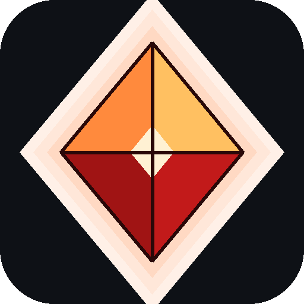

<p align="center">
  
</p>

<h1 align="center">Hunters Recomp</h1>

<p align="center">
  <b>Metroid Prime Hunters, running natively on the AYN Thor.</b><br/>
  The first Android port of the Metroid Prime Hunters recompilation:
  true dual-screen, twin-stick Prime controls, and HD rendering on real handheld hardware.
</p>

---

## See it running

<p align="center">
  <a href="https://youtube.com/shorts/t5mwzJvtyqY">
    
  </a>
  <br/>
  <sub><b><a href="https://youtube.com/shorts/t5mwzJvtyqY">▶ Watch: dual-screen gameplay on the Thor</a></b></sub>
</p>

## What is this?

A native Android port of
[mstan/MetroidPrimeHuntersRecomp](https://github.com/mstan/MetroidPrimeHuntersRecomp)
(built on the [ndsrecomp](https://github.com/mstan/ndsrecomp) static
recompilation framework), wrapped as an APK and adapted for the AYN Thor's
dual-screen handheld hardware. This is not an emulator frontend: the game's
ARM9/ARM7 code is statically recompiled to native arm64 and runs directly on
the Snapdragon.

**No game data is included.** You must supply your own dump of your own
cartridge (see below). The app hash-verifies it and refuses anything else.

## Features

- **True dual-screen**: top screen fills the Thor's main display, bottom
  screen lives on the Thor's second panel with working touch (stylus) input
- **Twin-stick Prime controls**: left stick moves, right stick aims
  (melonPrimeDS-style bindings), triggers shoot
- **HD rendering**: the desktop GL 4.3 compute renderer ported to GLES 3.2,
  running on the Adreno 740 with up to 4x internal resolution and xBR texture
  upscaling
- **Settings launcher**: rebind every touchscreen-mapped action to physical
  buttons, tune aim/stylus sensitivity, pick video quality
- **Fast-forward**: hold SELECT to blitz through cinematics

## Requirements

- AYN Thor (or another arm64 Android 11+ dual-screen device; only the Thor
  is tested)
- Your own dump of **Metroid Prime Hunters, USA revision 0** (`AMHE`, 64 MiB)
  - SHA-1 must be exactly `90164d1ac127ee5f9815ea4ae7de798c7b5fc629`
  - Dump it from your own cartridge (GodMode9 on a CFW 3DS works well)

## Install

1. Install the APK from [Releases](../../releases).
2. Copy your ROM dump to the app's data folder as `mph.nds`:
   ```
   adb push "Metroid Prime Hunters.nds" /sdcard/Android/data/com.thor.mph/files/mph.nds
   ```
   (or copy it there with any file manager after launching the app once)
3. Launch **Hunters Recomp**, adjust settings if you like, press **PLAY**.

## Controls (defaults)

| Input | Action |
|---|---|
| Left stick | Move |
| Right stick | Aim |
| RT / LT | Shoot / Scan-fire |
| A / B | Jump / Morph ball |
| X / Y | Missile / UI OK |
| LB / RB | Beam select / Boost-zoom |
| R3 | Scan visor |
| Start | Menu (skips cinematics) |
| Hold Select | Fast-forward |
| Bottom touchscreen | DS stylus |

Everything is rebindable from the settings screen.

## Building from source

The app shell (this repo) wraps the runner from the patched
[aabrole/ndsrecomp](https://github.com/aabrole/ndsrecomp/tree/thor-android-port)
fork (branch `thor-android-port`: Android/GLES/dual-screen support). The recompiled game
banks are generated at build time from *your* ROM by the upstream
[MetroidPrimeHuntersRecomp](https://github.com/mstan/MetroidPrimeHuntersRecomp)
project; they are not distributed in source form.

```
# 1. Generate the game banks (needs your AMHE-0 ROM):
cmake -S MetroidPrimeHuntersRecomp -B build -DNDSRECOMP_ROOT=../ndsrecomp && ninja -C build
# 2. Build the APK:
cd ThorMPH && ./gradlew assembleRelease
```

## Credits

- **AYN Thor port**: [Aman Abrole](https://github.com/aabrole)
- **Metroid Prime Hunters recompilation**:
  [mstan/MetroidPrimeHuntersRecomp](https://github.com/mstan/MetroidPrimeHuntersRecomp)
  and the [ndsrecomp](https://github.com/mstan/ndsrecomp) framework
- **GPU and Wi-Fi foundations**: [melonDS](https://github.com/melonDS-emu/melonDS)
  (GPL-3.0), [melonPrimeDS](https://github.com/makinori/melonPrimeDS) control scheme
- **Texture upscaling**: Hyllian's xBR-lv2 (MIT)
- **SDL2**: [libsdl-org/SDL](https://github.com/libsdl-org/SDL)

## License and legal

This project's code is licensed under the **GPL-3.0** (see [LICENSE](LICENSE)),
as required by its melonDS-derived components.

Metroid Prime Hunters, the Nintendo DS BIOS/firmware, and all related
trademarks are the property of Nintendo. **This project distributes no
Nintendo code or assets.** It requires your own legally dumped cartridge, and
the octolith icon and all branding here are original artwork. This project is
not affiliated with or endorsed by Nintendo, AYN, or the upstream projects.
